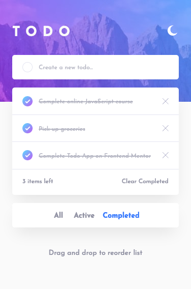
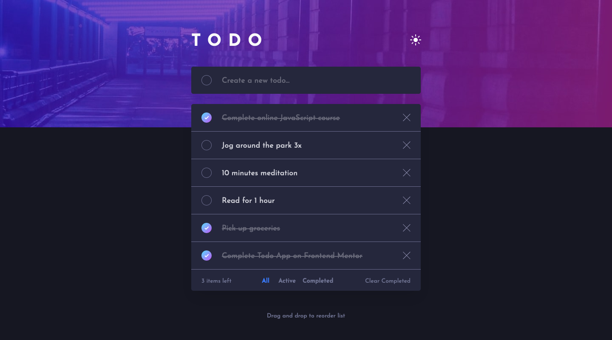

# Frontend Mentor - Todo App Solution

This is a solution to the [Todo App Challenge on Frontend Mentor](https://www.frontendmentor.io/challenges/todo-app-Su1_KokOW). Frontend Mentor challenges help you improve your coding skills by building realistic projects. 

## The challenge

Users should be able to:

- View the optimal layout for the app depending on their device's screen size
- See hover states for all interactive elements on the page
- Add new todos to the list
- Mark todos as complete
- Delete todos from the list
- Filter by all/active/complete todos
- Clear all completed todos
- Toggle light and dark mode
- **Bonus**: Drag and drop to reorder items on the list

## Screenshot

### Mobile


### Desktop


### Built with

- Semantic HTML5 markup
- CSS custom properties
- Flexbox
- CSS Grid
- Mobile-first workflow
- Vanilla JS

### What I learned

I'm pleased to report that I managed to accomplish the bonus challenge, which was to add drag and drop functionality so that the user can reorder the items in the list. I did however rely heavily on a video tutorial, therefore much of the code is copied and I have yet to understand exactly how each line of code works. I plan to revisit the video and others to gain a better understanding.

I had the opportunity to use `align-items: baseline` which is a property value I've always been aware of but never found a situation to apply it. I used it on a flex container (the `.todo-footer`) so that the child elements, which have different vertical padding values, line up together along the baseline of the text. I will keep an eye out for more situtations where this property value can be applied; I think I may have missed a few.

I was forced to learn about **Event Delegation** in this project because of the elements that are dynamically added when the user creates a to-do item. I added the event listener to the parent `<ol>` element as this is always present on the page, then I detect which element is being clicked by seeing if the clicked element has a specific class:
```js
TODO_LIST.addEventListener('click', e => {
    if (e.target.classList.contains('btn-delete-item')) {
       // More code
    }
})
```

This project also helped me understand how to create elements, attach classess and attributes, etc., and then append the elements to a parent. I'm sure jQuery would allow much simpler and cleaner code for this task, but I think practicing this with Vanilla JavaScript has been a very beneficial exercise for me.

## Continued development

The intermediate challenges on Frontend Mentor are definitely pushing my abilities, so I plan on working my way through some more of them. Meanwhile I am studying a course on Udemy and am about to start the module about AJAX and APIs which I think I'll need to know for some of the more advanced Frontend Mentor projects.

## Useful resources

- [How To Build Sortable Drag & Drop With Vanilla Javascript](https://www.youtube.com/watch?v=jfYWwQrtzzY) - This is the video that guided me through implementing drag and drop functionality on the page. It's a good video, however it's very fast and I feel that a few concepts could have been explained more.